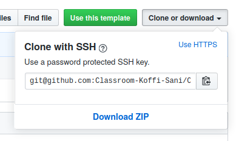

# Introduction to Linux: Exercises
Travaux pratiques de Linux -- Cours de CSC299 -- IPNet Institute

In these instructions the first character `$` in the command examples should not be typed, but it denotes the command prompt.

Some command lines are too long to fit a line in printed form. These are indicated by a backslash `\` at the end of line. It should not be included when typing in the command. For example : 

```
$ example command \
continues \
and continues
```
Should be typed in as:

```
example command continues and continues
```

## 1. Moving around in the directory tree
Metadata: commands in this exercise: cd, mkdir, ls, mv, more, less, cat, tar.

Metadata: The aim of this exercise is very simple: learn to move around with cd, look at file contents, create directories and move files around.

### a. Clone the project on your PC
Try to clone this project on your PC :



```
git clone <remote_server_adress>
```
### b. Find out what directories and files were created
```
$ ls
$ ls -l
$ cd inputs
$ ls -l
$ cd ..
Etc.
```
Take a screenshot of your command prompt and insert it in an issue in your repository entitled `1.a Directory list`.

### c. Which files contains the word "Magna" or "magna"
Below are some commands that you can try find out which file is about "Magna" or "magna". What are the other structures about?

You can view the complete file contents with either `more`, `less` or `cat`.

Which commands did you use ?

Create an issue with the output of your command line. The title should be 1.c Files containing "Magna" or "magna".

### d. Create subfolders
There are only two `files*` -directories. Create new ones : `filesAR`, `filesCN`,  `filesDE`, `filesEN`, and `filesPT` for files containing `AR`, `CN`, `DE`, `EN` and `PT` respectively and move the files to those directories. 

Use only one command to move these files to the corresponding directory.

Create an issue in the repository and insert the screenshots of the result of your commands.

### e. Create a new compressed tar file 
On your command line, create a compressed tar file with the following folders : `files2`, `files3`, `filesAR`, `filesCN`,  `filesDE`, `filesEN`, and `filesPT`. The tar file should be named `git_utils.tar.gz`.

```
$ tar zvcf git_utils.tar.gz <list_of_files_to_include_in_tar_file>
```

Add the compressed file to your index, commit and upload online.

## 2. Use the man command to find flags for ls
Metadata: commands in this exercise: man, ls

Metadata: learn how to find detailed info about flags, and sort ls output.

### a. Open the ls man page
```
$ man ls
```
This opens the man page for `ls`. As there are a lot of options for `ls` , it is useful to search the man page.
Search is triggered by pressing `/` and then writing a (start of) a keyword. Pressing "enter" triggers the search and pressing " n " proceeds to the next occurrence of the keyword. You can also scroll the screen with arrow keys when needed. Exit from the man page with "q"
 * Look for a flag to sort the `ls` output

`/sort` and press "enter" (note, you need to give this command while in the man page, not from command prompt).

Create an with the screenshot entitled `2.1 Opening the ls man page`.
